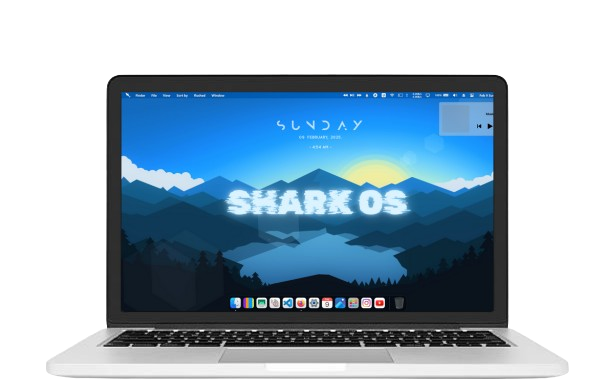

## SharkOS The New Windows11
# 

# SharkOS Windows 11 Edition 🌊

**Bringing high performance, stability, and a lightweight experience to Windows 11.**

## 🌟 Overview
SharkOS Windows 11 Edition is a specialized version of SharkOS designed to optimize Windows 11 while keeping it lightweight and efficient. It provides performance enhancements, gaming tweaks, and system optimizations for users who demand the best experience.

---

## 🚀 Key Features

### ⚡ Performance Optimization
- Custom scripts to enhance CPU and RAM efficiency.
- Power mode tuning for maximum system performance.
- Background process management to reduce unnecessary resource usage.

### 🛠️ Lightweight System Utilities
- Built-in performance benchmarking tools.
- Resource monitoring applications.
- Storage and memory management utilities.

### 🎮 Gaming & Benchmarking
- Low-latency optimizations for gaming.
- Real-time performance statistics overlay.
- Advanced system tuning for CPU & GPU.

### 🔒 Security & Privacy Enhancements
- Pre-configured privacy settings.
- Firewall and network optimizations.
- Automatic telemetry & bloatware removal.

### 🎨 Custom UI Enhancements
- Minimalist and performance-driven Windows theme.
- SharkOS-branded wallpapers, icons, and UI elements.
- Custom taskbar and Start menu configuration.

---

## 📥 Installation & Usage
1. **Download** the SharkOS Windows 11 Edition package.
2. **Run the Installer** to configure optimizations and tools.
3. **Restart** your system for changes to take effect.
4. **Access Features** via the SharkOS Control Panel.

---

## 🎯 Use Cases
✅ High-performance users seeking ultimate speed & responsiveness.  
✅ Gamers looking to reduce latency & improve FPS.  
✅ Developers needing a clean, minimal environment.  
✅ System testers pushing hardware to its limits.  

---

## 🌊 Experience SharkOS Windows 11 Edition

🚀 **Optimized. Fast. Powerful.**  
💻 **Transform Windows 11 into a true performance machine!**

📌 **[Visit the Official Website](https://d3f4ult-dev.github.io/SharkOS.org)**.
